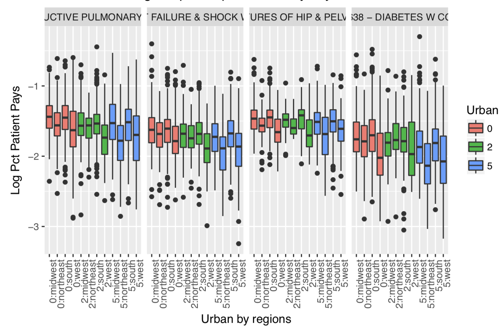
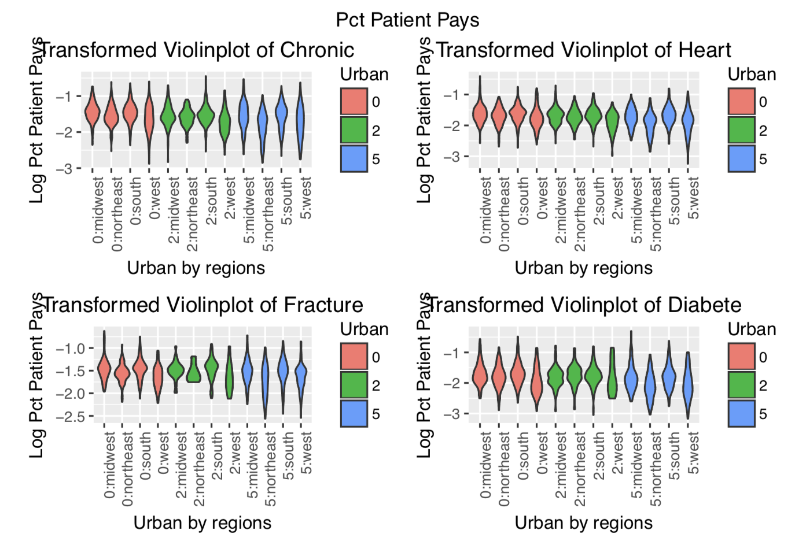
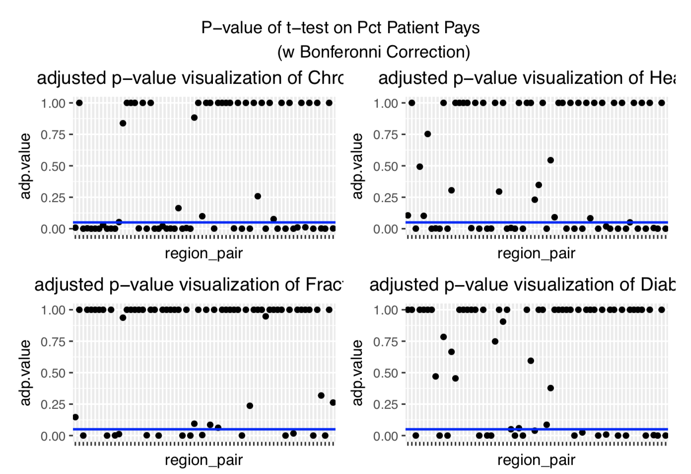

# Statistical Analysis on Medical Services in U.S.
(course project)

This project is about analyzing a dataset from Centers for Medicare and Medicaid Services ([Link](https://www.cms.gov/research-statistics-data-and-systems/statistics-trends-and-reports/medicare-provider-charge-data/inpatient.html)) using statistical methods.

## Dataset
The dataset we use gives the cumulative charges for procedures billed to Medicare for more than 3,000 U.S. hospitals and includes more than 14,000 records for Fiscal Year 2011 (Fiscal Year: the 12-month period ending on 30 September of that year, having begun on 1 October of the previous calendar year). The dataset is intended to help Medicare recipients to have a sense of the costs at different institutes or for different procedures (Medicare beneficiaries still will have remaining out-of-pocket costs after the federal government pays its portion). It can be found in [dataset](./dataset/) folder.
.

## Analysis
In this project, I evaluated how the the amount a patient has to pay change for different regions or urban/rural areas of the country. First I used data cleansing to eliminate invalid records in original dataset. Then I explored distributions of payment in groups of each factor (like diagnosis) to find out its influence, during which logarithm transformation was applied to pre-process skewed data. Furthermore, I performed inference (like t-test) to estimate the difference between the groups and finally reached the conclusion according to the results. Visualization using `ggplot` were created to make the results directviewing. For more details, please take a look at my [analysis report](./Yudongzhang_project.pdf).

Some visualization of our results are as follows:
- boxplot & violinplot of group distributions

- t-test with Bonferonni Correction

